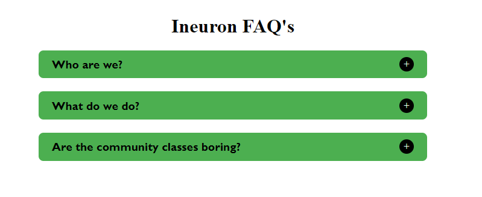

# Accordition in JS

## Techniques used
- html
- css
- JavaScript

### Time Taken: 5 hours

In this project I have written js code to create faq container, faq header with heading and button and paragraph also. Hiding and displaying the paragraph was difficult to make.Then I reffered some documents and solved it.

